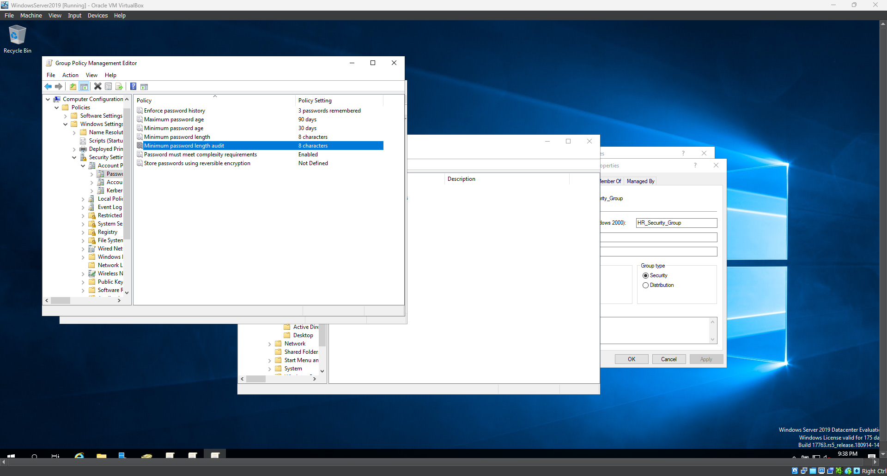

# Active Directory and Linux Server Lab with Terraform and Vagrant

## Overview
This project sets up a local lab environment for practicing system administration, cloud automation, and network configuration. The setup includes:
- A Windows Server 2019 VM acting as a Domain Controller.
- A Linux Ubuntu 22.04 Desktop VM joined to the Active Directory domain.
- Security features such as firewall setup and domain authentication.
- Automation of infrastructure using Terraform and Vagrant.

## Goals
- Understand the basics of configuring and managing Active Directory.
- Learn to connect Linux to a Windows domain.
- Practice infrastructure automation using Terraform and Vagrant.
- Enhance security with hardening techniques.

## Tools and Technologies
- Vagrant
- VirtualBox
- Terraform
- Windows Server 2019
- Ubuntu 22.04 (GUI)
- Azure (optional)

## Getting Started
1. Clone this repository:
   ```bash
   git clone https://github.com/wilkins2john/ActiveDirectory_HomeLab_Project.git
   cd yourproject

## Active Directory Domain Controller Setup
- Added the AD DS role to the Windows Server.
- Promoted the server to a domain controller with the domain `globexcorporation.local`(fake company name).
- Verified domain and DNS settings.
- Opened **DNS Manager**.
- Verified the **Forward Lookup Zone** for `globlexcorporation.local`.
- Checked for an existing A Record for `DC01` with IP `192.168.56.10`.
- Verified DNS using:
  - `nslookup DC01.globlexcorporation.local` on Windows.
  - `nslookup DC01.globlexcorporation.local 192.168.56.10` on Linux.

### Outcome
- The A Record was successfully added and resolved to the correct IP `192.168.56.10`.

## Active Directory Configuration

### Objective
Configure Active Directory to simulate a company environment.

### Steps Performed
1. Created Organizational Units (OUs) for:
   - IT
   - HR
   - Finance
2. Created test users within each OU.

## Group Policy Configuration

### Objective
Implement and test group policies to enforce specific settings for each organizational unit (OU).

### Steps Performed
1. Created Group Policies for:
   - **HR**:
     - Restricted access to the Control Panel.
     - Set a custom desktop wallpaper.
   - **IT**:
     - Allowed software installation with elevated privileges.
     - Configured remote desktop access.
   - **Finance**:
     - Enforced stricter password policies.
     - Disabled access to the Command Prompt.
2. Linked each policy to its respective OU in Group Policy Management.

### Screenshots
- OU Structure: 
- Created User: 

**New Folder**: `screenshots/group_policy`

- HR Group Policy Creation: 
- IT Group Policy Creation: 
- Finance Group Policy Creation: 
- Policy Linked to OU: 